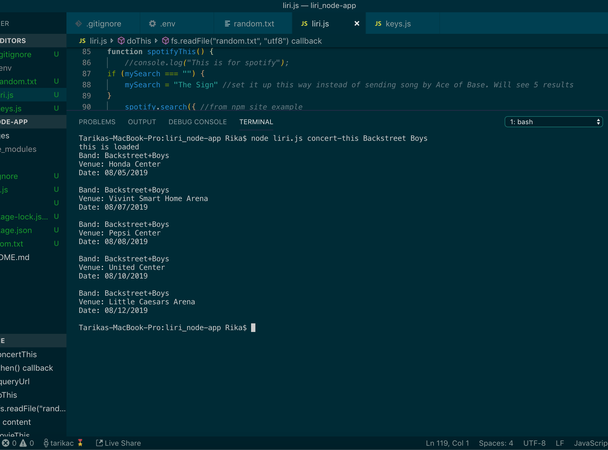
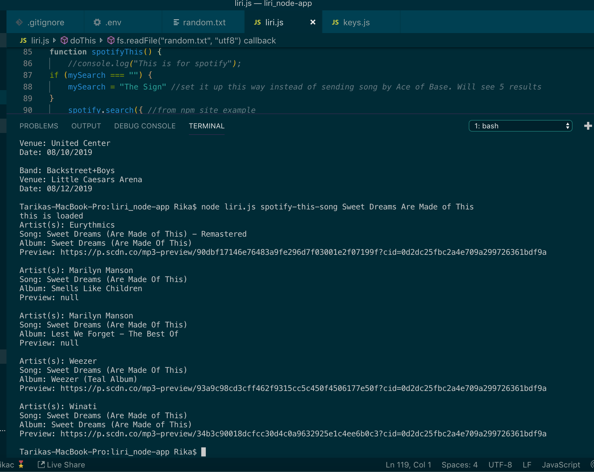
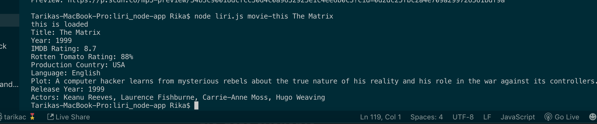
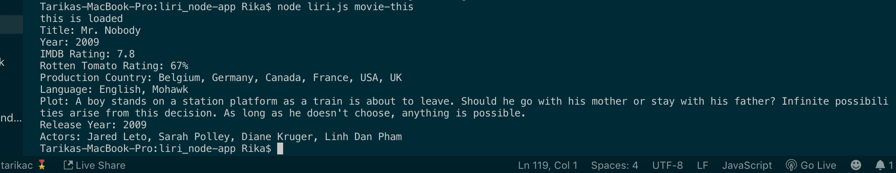

# My Liri Bot

## Homework Instructions
You will make a LIRI: _language_Interpretation and Recognition Interface. LIRI will be a command line node app that takes in parameters and gives you back data. 

## APIS
- OMDB 
- Spotify
- Bands in town

## Commands
The below commands will be used to pull data from the API's used
- concert-this
- spotify-this-song
- movie-this
- do-what-it-says

## .env
Make sure to create your on .env file to store your spotify key information in order to run that portion of the application.

## if a search parameter is not provided, a default band, song/artist(s), movie will populate

## concert-this

## spotify-this-song

## movie-this

## movie-this without paramenter

## do-this
![alt_text] (images/do=this.png "do-this")
